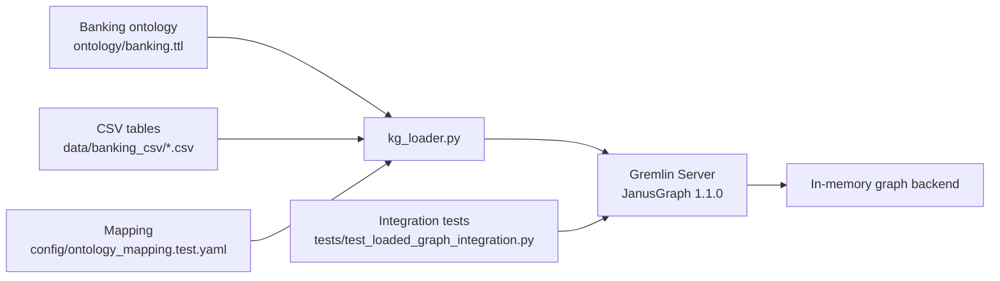
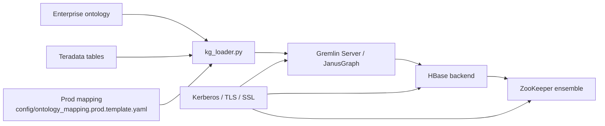

# Enterprise Ontology to JanusGraph Loader — Detailed Usage Guide

This document is the end-to-end operational guide for the project in `/home/vijay/kg`.

It covers:

- architecture,
- design,
- repository structure,
- local **test mode**,
- production **prod mode**,
- ontology and mapping model,
- sample banking dataset,
- JanusGraph validation tests,
- troubleshooting and extension guidance.

---

## 1. What this project does

This project loads a knowledge graph into **JanusGraph** from an **enterprise ontology** plus a **physical source mapping**.

The loader supports two operating modes:

1. **Test mode**
   - JanusGraph backend: **in-memory**
   - Source system: **CSV files**
   - Intended for local development, demos, and automated validation

2. **Prod mode**
   - JanusGraph backend: **HBase** (through JanusGraph server)
   - Source system: **Teradata**
   - Intended for enterprise deployment

The same ontology-driven loader code powers both modes.

---

## 2. High-level architecture

## 2.1 Test mode architecture



## 2.2 Prod mode architecture



## 2.3 Design principle

The Python loader **does not connect directly to HBase or ZooKeeper**.

Instead:

- Python connects to **JanusGraph / Gremlin Server**.
- JanusGraph server handles backend storage integration.
- HBase, ZooKeeper, Kerberos, and TLS are configured on the **server side**.

This keeps ingestion logic separate from backend storage plumbing.

---

## 3. Repository layout

```text
/home/vijay/kg
├── .env
├── README.md
├── backups/
│   └── kg_loader.monolith.backup.20260310.py
├── kg_loader.py
├── kg_loader/
│   ├── __init__.py
│   ├── __main__.py
│   ├── cli.py
│   ├── config.py
│   ├── constants.py
│   ├── data_clients.py
│   ├── gremlin.py
│   ├── loader.py
│   ├── ontology.py
│   ├── schema.py
│   └── utils.py
├── requirements.txt
├── config/
│   ├── janusgraph-hbase-secure.properties.template
│   ├── ontology_mapping.prod.template.yaml
│   ├── ontology_mapping.sample.yaml
│   └── ontology_mapping.test.yaml
├── data/
│   └── banking_csv/
├── docs/
│   └── USAGE_GUIDE.md
├── ontology/
│   └── banking.ttl
├── scripts/
│   ├── generate_banking_sample_data.py
│   ├── install_janusgraph_local.sh
│   ├── run_graph_validation_tests.sh
│   ├── run_local_test_mode.sh
│   ├── start_janusgraph_test.sh
│   ├── stop_janusgraph_test.sh
│   └── verify_graph_summary.py
├── tests/
│   ├── test_kg_loader.py
│   └── test_loaded_graph_integration.py
└── tools/
    └── janusgraph-1.1.0/
```

---

## 4. Core components

## 4.1 `kg_loader.py` and `kg_loader/`

`kg_loader.py` is the stable CLI entrypoint kept for backward compatibility.

The implementation now lives in the modular `kg_loader/` package.

Key responsibilities:

- `kg_loader/config.py`
  - mapping and runtime dataclasses
- `kg_loader/ontology.py`
  - ontology parsing, reasoning, and ontology-aware validation
- `kg_loader/schema.py`
  - JanusGraph schema planning
- `kg_loader/data_clients.py`
  - CSV and Teradata source access
- `kg_loader/gremlin.py`
  - Gremlin scripts and JanusGraph client
- `kg_loader/loader.py`
  - orchestration of end-to-end loading
- `kg_loader/cli.py`
  - command-line parsing and report output
- `kg_loader/utils.py`
  - shared validation, coercion, and helper utilities

## 4.2 Mapping files

Two main mapping profiles are included:

- `config/ontology_mapping.test.yaml`
  - local CSV mode
  - in-memory JanusGraph
  - sample banking dataset

- `config/ontology_mapping.prod.template.yaml`
  - production Teradata mode
  - production JanusGraph server

## 4.3 Ontology file

- `ontology/banking.ttl`

Contains the sample banking ontology with:

- 10 classes,
- datatype properties,
- object properties.

## 4.4 Sample data generator

- `scripts/generate_banking_sample_data.py`

Generates the local CSV source tables used by the test profile.

## 4.5 Validation tests

- `tests/test_kg_loader.py`
  - unit and configuration tests
- `tests/test_loaded_graph_integration.py`
  - live JanusGraph integration validation

---

## 5. Supported data flow model

The loader expects:

1. an ontology,
2. a mapping file,
3. a source system,
4. a JanusGraph server.

The loader then:

1. parses ontology terms,
2. reasons over supported ontology hierarchies and constraints,
3. validates that mapped IRIs and mappings are ontology-compatible,
4. creates JanusGraph property keys / labels / indexes,
5. loads vertices for each mapped class,
6. loads datatype properties,
7. loads edges for object properties,
8. stores metadata such as:
   - `external_id`
   - `ontology_iri`
  - `rdf_types`
   - `source_table`
   - `source_primary_key`
   - `edge_external_id`
  - `ontology_property_lineage`
  - `ontology_inverse_property_iris`
   - `load_batch_id`
   - `loaded_at`

---

## 6. Sample banking model used in test mode

The local test dataset contains **13 CSV tables**.

## 6.1 Entity-style tables

- `customer_dim.csv`
- `branch_dim.csv`
- `employee_dim.csv`
- `product_dim.csv`
- `account_dim.csv`
- `card_dim.csv`
- `loan_dim.csv`
- `transaction_fact.csv`
- `beneficiary.csv`
- `alert_fact.csv`

## 6.2 Supporting / bridge tables

- `customer_address.csv`
- `customer_phone.csv`
- `account_customer_bridge.csv`

## 6.3 Ontology classes in the sample

- `Customer`
- `Branch`
- `Employee`
- `Product`
- `Account`
- `Card`
- `Loan`
- `Transaction`
- `Beneficiary`
- `Alert`

## 6.4 Relationship types in the sample

- `ownsAccount`
- `issuedByBranch`
- `managedByEmployee`
- `belongsToProduct`
- `worksAtBranch`
- `hasCard`
- `hasLoan`
- `postedTransaction`
- `beneficiaryForAccount`
- `hasAlert`

---

## 7. Prerequisites

## 7.1 Required software

- Linux shell
- Java 21 or compatible JVM
- `curl`
- `unzip`
- Python at:
  - `~/anaconda3/bin/python3`

## 7.2 Python packages

Install with:

```bash
~/anaconda3/bin/python3 -m pip install -r requirements.txt
```

This installs:

- `gremlinpython`
- `python-dotenv`
- `PyYAML`
- `rdflib`
- `teradatasql`

---

## 8. Environment variables

The repository includes `.env` placeholders.

Important variables include:

### JanusGraph connection

- `JANUSGRAPH_URL`
- `JANUSGRAPH_TRAVERSAL_SOURCE`
- `JANUSGRAPH_GRAPH_ALIAS`
- `JANUSGRAPH_USERNAME`
- `JANUSGRAPH_PASSWORD`
- `JANUSGRAPH_SSL_VERIFY`
- `JANUSGRAPH_SSL_CA_FILE`
- `JANUSGRAPH_SSL_CERT_FILE`
- `JANUSGRAPH_SSL_KEY_FILE`
- `JANUSGRAPH_REQUEST_TIMEOUT_SECONDS`

### Teradata connection

- `TERADATA_HOST`
- `TERADATA_DATABASE`
- `TERADATA_USER`
- `TERADATA_PASSWORD`
- `TERADATA_LOGMECH`
- `TERADATA_ENCRYPTDATA`
- `TERADATA_TMODE`
- `TERADATA_LOGDATA`
- `TERADATA_EXTRA_PARAMS`

### Optional Kerberos bootstrap

- `TERADATA_KRB5_PRINCIPAL`
- `TERADATA_KRB5_KEYTAB`

### Loader defaults

- `KG_BATCH_SIZE`
- `KG_STRICT_ONTOLOGY`

---

## 9. Mapping model explained

A mapping file has these top-level sections:

- `ontology`
- `janusgraph`
- `runtime`
- `ingestion`
- `classes`
- `relationships`

## 9.1 `ingestion`

Example:

```yaml
ingestion:
  mode: test
  source_type: csv
  csv_root_dir: ../data/banking_csv
  csv_delimiter: ","
  csv_encoding: utf-8
```

Supported values:

- `mode`: `test` or `prod`
- `source_type`: `csv` or `teradata`

## 9.2 `classes[]`

Each class mapping defines:

- ontology class IRI,
- JanusGraph vertex label,
- source table or source SQL,
- key column,
- stable vertex ID template,
- datatype properties.

Example pattern:

```yaml
- iri: https://example.com/ontology/bank#Customer
  vertex_label: Customer
  id_template: Customer:{customer_id}
  source:
    table: customer_dim
    key_column: customer_id
  properties:
    - iri: https://example.com/ontology/bank#customerName
      property_key: customerName
      source_column: customer_name
      data_type: String
```

## 9.3 `relationships[]`

Each relationship mapping defines:

- ontology object-property IRI,
- source class IRI,
- target class IRI,
- source relationship table,
- source foreign key column,
- target foreign key column,
- stable edge ID template,
- optional edge properties.

Example pattern:

```yaml
- iri: https://example.com/ontology/bank#ownsAccount
  edge_label: ownsAccount
  source_class_iri: https://example.com/ontology/bank#Customer
  target_class_iri: https://example.com/ontology/bank#Account
  id_template: ownsAccount:{customer_id}:{account_id}
  source:
    table: account_customer_bridge
    from_column: customer_id
    to_column: account_id
  properties:
    - iri: https://example.com/ontology/bank#relationshipType
      property_key: relationshipType
      source_column: relationship_type
      data_type: String
```

## 9.4 External attribute tables

For properties that come from a different table than the main entity table, use:

- `source_table`
- `entity_key_column`

Example:

```yaml
- iri: https://example.com/ontology/bank#city
  property_key: city
  source_column: city
  source_table: customer_address
  entity_key_column: customer_id
```

---

## 10. Local test mode — complete workflow

## 10.1 Generate the sample CSV data

```bash
~/anaconda3/bin/python3 scripts/generate_banking_sample_data.py
```

Output goes to:

```text
data/banking_csv/
```

## 10.2 Install local JanusGraph

```bash
bash scripts/install_janusgraph_local.sh
```

This installs JanusGraph under:

```text
tools/janusgraph-1.1.0/
```

## 10.3 Start the local in-memory JanusGraph server

```bash
bash scripts/start_janusgraph_test.sh
```

The script is idempotent:

- if the server is already listening on `127.0.0.1:8182`, it returns successfully,
- otherwise it starts JanusGraph and waits for readiness.

## 10.4 Dry-run the local mapping

```bash
~/anaconda3/bin/python3 kg_loader.py \
  --mapping config/ontology_mapping.test.yaml \
  --dry-run \
  --report-file load_report.dryrun.json \
  --log-level INFO
```

Dry-run performs:

- ontology parsing,
- mapping validation,
- source preview generation,
- schema plan generation,
- no graph mutation.

## 10.5 Load the local graph

```bash
~/anaconda3/bin/python3 kg_loader.py \
  --mapping config/ontology_mapping.test.yaml \
  --report-file load_report.test.json \
  --log-level INFO
```

## 10.6 Verify graph summary

```bash
~/anaconda3/bin/python3 scripts/verify_graph_summary.py
```

Expected local sample result after load:

- 29 vertices
- 29 edges

## 10.7 Run the complete local flow in one command

```bash
bash scripts/run_local_test_mode.sh
```

This will:

1. regenerate CSV data,
2. ensure JanusGraph is installed,
3. ensure JanusGraph is running,
4. install Python dependencies,
5. load the graph,
6. print a graph summary.

## 10.8 Stop local JanusGraph

```bash
bash scripts/stop_janusgraph_test.sh
```

---

## 11. Graph validation test suite

A dedicated **JanusGraph-backed integration suite** is included.

File:

```text
tests/test_loaded_graph_integration.py
```

## 11.1 What the integration tests validate

The current suite validates all of the following directly from **JanusGraph**:

1. JanusGraph is reachable.
2. Vertex counts match the input CSV data.
3. Edge counts match the input CSV data.
4. Vertex `ontology_iri` metadata matches the ontology mapping.
5. Edge `ontology_iri` metadata matches the ontology mapping.
6. All vertices contain required load metadata.
7. All edges contain required load metadata.
8. Every expected vertex exists with the correct properties.
9. Customer external properties loaded from secondary CSV tables are correct.
10. Every expected edge exists with the correct endpoints and properties.
11. Edge source/target labels match the ontology domain/range mapping.
12. Subclass and equivalent-class querying works through `rdf_types`.
13. Supported OWL restrictions are satisfied by the loaded graph.

## 11.2 How the validation suite works

The tests do **not** hardcode graph totals manually.

Instead, they derive expectations from:

- `config/ontology_mapping.test.yaml`
- `ontology/banking.ttl`
- the generated CSV source files

Then they query JanusGraph live and compare:

- labels,
- properties,
- counts,
- ontology metadata,
- edge endpoints,
- relationship properties.

This makes the tests resilient to future sample-data changes.

## 11.3 Run only the integration validation tests

```bash
~/anaconda3/bin/python3 -m unittest discover -s tests -p 'test_loaded_graph_integration.py' -v
```

## 11.4 Run the validation workflow in one command

```bash
bash scripts/run_graph_validation_tests.sh
```

This script will:

1. regenerate the CSV sample data,
2. ensure JanusGraph is installed,
3. ensure the local JanusGraph server is running,
4. reload the sample graph idempotently,
5. execute the full local Python test suite in the correct order.

---

## 12. Unit test suite

Unit and configuration tests live in:

```text
tests/test_kg_loader.py
```

They cover:

- environment substitution,
- config validation,
- template validation,
- URL validation,
- schema planning,
- management script generation,
- CSV projection behavior.

Run them with:

```bash
~/anaconda3/bin/python3 -m unittest discover -s tests -p 'test_kg_loader.py' -v
```

Run all tests with:

```bash
~/anaconda3/bin/python3 -m unittest discover -s tests -p 'test_*.py' -v
```

---

## 13. Prod mode — operational flow

## 13.1 Prepare JanusGraph server

On the JanusGraph/Gremlin Server host, adapt:

```text
config/janusgraph-hbase-secure.properties.template
```

This template is a baseline for:

- HBase backend,
- ZooKeeper,
- Kerberos,
- ZooKeeper SSL/TLS.

## 13.2 Configure prod environment variables

Populate `.env` or the runtime environment with:

- JanusGraph connection settings,
- Teradata connection settings,
- optional Kerberos bootstrap values.

## 13.3 Create your real production mapping

Start from:

```text
config/ontology_mapping.prod.template.yaml
```

Then replace:

- ontology IRIs,
- Teradata schema/table names,
- source columns,
- relationship tables,
- external property tables,
- ID templates.

## 13.4 Dry-run before loading

```bash
./run_kg_loader.sh \
  --mapping config/your_prod_mapping.yaml \
  --dry-run \
  --report-file load_report.prod.dryrun.json \
  --log-level INFO
```

## 13.5 Execute the production load

```bash
./run_kg_loader.sh \
  --mapping config/your_prod_mapping.yaml \
  --report-file load_report.prod.json \
  --log-level INFO
```

Or directly:

```bash
~/anaconda3/bin/python3 kg_loader.py \
  --mapping config/your_prod_mapping.yaml \
  --report-file load_report.prod.json \
  --log-level INFO
```

---

## 14. Loader design details

## 14.1 Why Python

Python is used because the pipeline needs to combine:

- ontology parsing,
- structured mapping parsing,
- CSV/Teradata access,
- Gremlin interactions,
- schema creation,
- validation,
- reporting,
- testability.

A shell-only implementation would be much harder to validate and maintain.

## 14.2 Data source abstraction

The loader supports different source systems through a common client abstraction:

- `CsvClient`
- `TeradataClient`

Both provide row batches to the same graph-load logic.

## 14.3 Idempotency strategy

Vertices are upserted using:

- `external_id`

Edges are upserted using:

- `edge_external_id`

This means repeated runs do not intentionally duplicate graph elements when the source data and ID templates are stable.

## 14.4 Schema creation

The loader creates, if missing:

- property keys,
- vertex labels,
- edge labels,
- graph indexes declared in the mapping file,
- schema constraints declared implicitly by the mapped labels/properties/connections,
- vertex-centric relation indexes declared in the mapping file.

Important JanusGraph compatibility notes discovered during live testing:

- edge composite indexes cannot be unique in JanusGraph,
- `Date` is mapped through a JanusGraph-supported Java type,
- logical `Decimal` values are materialized as `Double` for JanusGraph compatibility.

### Graph index support now included

The loader supports configurable **graph-global indexes** for both vertices and edges through the top-level `indexes:` section in the mapping file.

Supported today:

- composite vertex indexes
- composite edge indexes
- multi-property composite indexes
- label-constrained indexes via `index_only`
- mixed indexes for search/range workloads when the JanusGraph server is already configured with a mixed-index backend
- advanced mixed-index key mapping parameters (`mapping`, analyzers, mapped field names, custom parameters)
- edge relation indexes via `vertex_centric_indexes.edge_indexes`
- property relation indexes via `vertex_centric_indexes.property_indexes`
- query-pattern-driven index recommendations emitted in the load report

If you declare a **unique composite index** on an eventually consistent storage backend, make sure the JanusGraph storage/locking configuration is aligned with that uniqueness requirement. The loader can define the index, but backend consistency still matters.

New JanusGraph settings in the mapping file:

- `janusgraph.index_activation_mode`
  - `reindex` — safest default; if a new index is created, the loader reindexes it and waits for `ENABLED`
  - `enable` — enables newly created indexes without reindexing old data
  - `skip` — creates the index definition only and leaves activation to an operator
- `janusgraph.index_reindex_concurrency`
  - optional concurrency hint for management-system reindex jobs
- `janusgraph.relation_index_activation_mode`
  - same semantics as graph index activation, but for JanusGraph relation indexes
- `janusgraph.relation_index_reindex_concurrency`
  - optional concurrency hint for relation-index reindex jobs
- `janusgraph.create_schema_constraints`
  - applies `addProperties` / `addConnection` constraints for mapped labels and edges

### Why this matters in production

Without a JanusGraph index, Gremlin queries often degrade into full scans.

That is especially painful for:

- `g.V().has('<property>', value)` entry points,
- `g.E().has('<property>', value)` edge lookups,
- exact-match traversals over large label populations.

The loader now creates the configured indexes **before or alongside the load**, and if a new index is introduced later on top of existing data, the default activation mode will reindex it so the old data becomes visible through the new index.

### Vertex-centric and constraint support now included

This implementation now creates both **graph-global indexes** and **vertex-centric JanusGraph relation indexes**.

Use `vertex_centric_indexes.edge_indexes` when your hot path looks like this:

- start from one vertex,
- traverse thousands/millions of incident edges,
- filter by edge property or order by an edge-local sort key.

Use `vertex_centric_indexes.property_indexes` when you model repeated vertex-property values plus meta-properties and need to traverse those values efficiently by meta-property.

The loader also applies JanusGraph schema constraints using `addProperties` / `addConnection` so the server can reject writes that violate the mapped label/property/connection model when `schema.constraints=true` is enabled server-side.

## 14.5 Metadata stored on graph elements

### Vertex metadata

- `external_id`
- `ontology_iri`
- `rdf_types` (the mapped class plus superclasses/equivalent classes)
- `source_table`
- `source_primary_key`
- `load_batch_id`
- `loaded_at`

### Edge metadata

- `edge_external_id`
- `ontology_iri`
- `ontology_property_lineage` (mapped property plus super/equivalent properties)
- `ontology_inverse_property_iris`
- `source_table`
- `load_batch_id`
- `loaded_at`

## 14.6 Ontology semantics currently supported

The loader now supports a practical enterprise subset of ontology semantics.

### Class reasoning

- `rdfs:subClassOf`
- `owl:equivalentClass`
- superclass closure persisted on vertices through `rdf_types`

### Property reasoning

- `rdfs:subPropertyOf`
- `owl:equivalentProperty`
- `owl:inverseOf`
- property lineage persisted on edges through `ontology_property_lineage`

### Property characteristics

- `owl:FunctionalProperty`
- `owl:InverseFunctionalProperty`
- parsing support for transitive / symmetric / asymmetric / reflexive / irreflexive properties

### Constraint parsing and validation

The ontology parser and local validation suite support these OWL restriction styles:

- `owl:minCardinality`
- `owl:maxCardinality`
- `owl:cardinality`
- `owl:minQualifiedCardinality`
- `owl:maxQualifiedCardinality`
- `owl:qualifiedCardinality`
- `owl:someValuesFrom`
- `owl:allValuesFrom`
- `owl:hasValue`

### Where those semantics are applied

1. **mapping validation**
  - domain/range checks use subclass and equivalent-class reasoning
  - functional and max-cardinality constraints are checked against configured mapping cardinality / multiplicity

2. **load-time metadata**
  - vertices receive `rdf_types`
  - edges receive lineage and inverse-property metadata

3. **live local graph validation**
  - the JanusGraph-backed integration suite validates supported restrictions against loaded data

## 14.7 Current OWL boundaries

This is not a full general-purpose OWL reasoner.

The current implementation does **not** attempt to fully materialize or enforce all possible OWL constructs, especially:

- `owl:unionOf`
- `owl:intersectionOf`
- `owl:complementOf`
- `owl:oneOf`
- arbitrary nested anonymous class expressions beyond the supported restriction set
- automatic entity merging via `owl:sameAs`
- automatic inverse-edge creation in JanusGraph
- full disjointness conflict detection across independently mapped datasets

Those can be added later if your enterprise ontology relies heavily on them, but the current feature set already covers the most common operational requirements for class hierarchies, relationship hierarchies, domain/range validation, and practical cardinality constraints.

---

## 15. Reports and outputs

The loader can write a JSON report via `--report-file`.

Example:

```bash
~/anaconda3/bin/python3 kg_loader.py \
  --mapping config/ontology_mapping.test.yaml \
  --report-file load_report.test.json
```

The report includes:

- batch ID,
- timestamps,
- mode and source type,
- schema plan,
- query-pattern-driven index recommendations,
- schema action summaries for graph indexes, relation indexes, and constraints,
- per-class load statistics,
- per-relationship load statistics.

---

## 16. Troubleshooting

## 16.1 JanusGraph already running

If the local server is already up, the updated start script should simply return success.

Manual stop:

```bash
bash scripts/stop_janusgraph_test.sh
```

## 16.2 Loader cannot connect to JanusGraph

Check:

```bash
bash scripts/start_janusgraph_test.sh
~/anaconda3/bin/python3 scripts/verify_graph_summary.py
```

If needed, inspect JanusGraph logs under the local installation.

## 16.2.1 Queries are slow or full scans appear in production

Check all of the following:

- the queried property is covered by a configured graph index,
- the index status is `ENABLED`,
- if the index was added after data already existed, it was reindexed,
- the JanusGraph server has `query.force-index=true` in production.

JanusGraph guidance used for this loader design:

- create indexes in the same schema phase as property keys and labels whenever possible,
- wait for newly created indexes to register across the cluster,
- use `REINDEX` when the graph already contains data for those keys,
- only use mixed indexes when the workload actually needs text/range/geo predicates.

If an index remains stuck before `REGISTERED` or `ENABLED`, check for stale/zombie JanusGraph instances in the cluster before retrying the activation flow.

## 16.2.2 Current KG capability gaps beyond indexing

From an enterprise ontology / knowledge graph perspective, the most important capabilities still missing from this application are:

### Critical now

- SHACL validation of loaded data
- post-load semantic validation of graph data against ontology promises
- entity resolution / deduplication beyond source-system IDs
- richer provenance and data-quality metrics

### Useful next

- incremental / CDC-style loading instead of full reload patterns
- temporal versioning and rollback-oriented graph snapshots

### Future roadmap

- full OWL 2 reasoning beyond the current practical subset
- multi-ontology alignment and federation
- knowledge-graph completion / link prediction

So: index lifecycle support is now built into the loader, but it is only one part of the broader enterprise KG story.

## 16.3 Production server TLS / SSL issues

Verify:

- `JANUSGRAPH_URL`
- `JANUSGRAPH_SSL_VERIFY`
- CA / cert / key paths
- the server-side Gremlin Server configuration

## 16.4 Teradata connection issues

Check:

- host,
- user/password or Kerberos logon mechanism,
- `TERADATA_EXTRA_PARAMS`,
- network/firewall access,
- ticket availability if using `KRB5`.

## 16.5 CSV mode validation failures

Common causes:

- CSV file missing under `data/banking_csv/`
- wrong column names
- wrong table name in the test mapping
- template placeholders that are not returned by the source data

## 16.6 Ontology validation failures

If `strict_ontology: true`, the loader will fail when:

- mapped class IRIs are missing from the ontology,
- mapped property IRIs are missing from the ontology,
- datatype vs object-property usage is inconsistent.

---

## 17. Recommended daily commands

## 17.1 Fast local load and verify

```bash
bash scripts/run_local_test_mode.sh
```

## 17.2 Run JanusGraph-backed validation tests

```bash
bash scripts/run_graph_validation_tests.sh
```

## 17.3 Run all Python tests

```bash
~/anaconda3/bin/python3 -m unittest discover -s tests -p 'test_*.py' -v
```

## 17.4 Dry-run a mapping

```bash
~/anaconda3/bin/python3 kg_loader.py \
  --mapping config/ontology_mapping.test.yaml \
  --dry-run \
  --report-file load_report.dryrun.json
```

---

## 18. How to adapt this for your real ontology

To move from the sample banking model to your enterprise model:

1. replace `ontology/banking.ttl` with your real ontology file,
2. clone and adapt `config/ontology_mapping.prod.template.yaml`,
3. set real Teradata table and column names,
4. define stable `id_template` values for vertices and edges,
5. dry-run first,
6. load into the target JanusGraph environment,
7. add a production-specific validation test suite similar to `tests/test_loaded_graph_integration.py`.

---

## 19. Summary

This repository now provides:

- a reusable ontology-driven JanusGraph loader,
- dual-mode ingestion (**CSV/test** and **Teradata/prod**),
- a working local JanusGraph installation script,
- a complete sample banking ontology and dataset,
- automated validation against the live loaded graph,
- production-oriented configuration templates.

For local development, the most useful commands are:

```bash
bash scripts/run_local_test_mode.sh
bash scripts/run_graph_validation_tests.sh
```

For production, start from:

```text
config/ontology_mapping.prod.template.yaml
config/janusgraph-hbase-secure.properties.template
```
